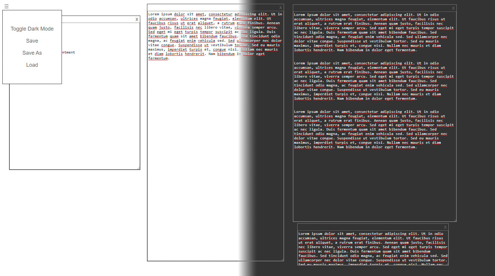

A simple note taker that saves your notes into localstorage.

You can create notes, move them around and resize them at the bottom right corner. You can save and load the localstorage.

Nice and simple.

Also avalible on GitHub Pages: https://skipyc.github.io/NoteTaker/

